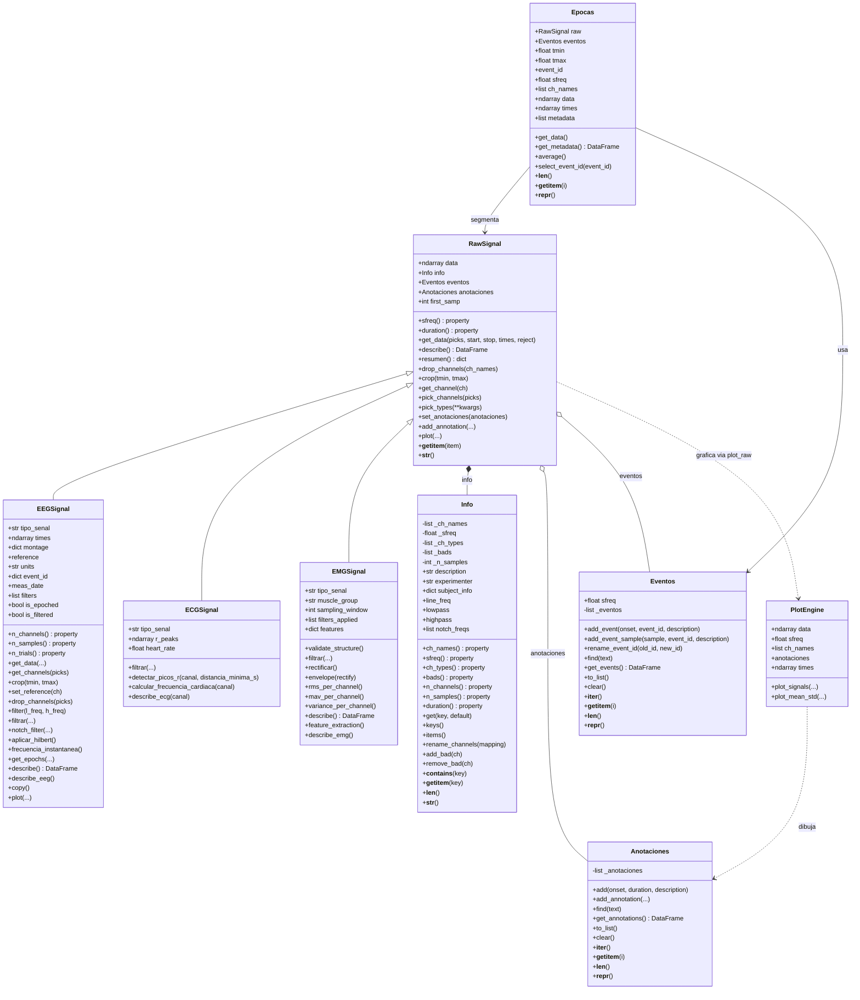

# Diagrama UML - TPI Analisis de Senales

Diagrama de clases actual de la libreria. Se renderiza automaticamente en GitHub
y en VS Code (extension Markdown Preview Mermaid).

## Relaciones

- **Herencia:** `EEGSignal`, `ECGSignal` y `EMGSignal` heredan de `RawSignal`.
- **Composicion:** `RawSignal` contiene un objeto `Info` (no existe sin metadata).
- **Agregacion:** `RawSignal` tiene `Anotaciones` y `Eventos` (pueden ser opcionales).
- **Dependencia:** `Epocas` segmenta una senal (`RawSignal`) a partir de sus `Eventos`;
  la visualizacion (`PlotEngine`) recibe los datos y las anotaciones para graficar.
